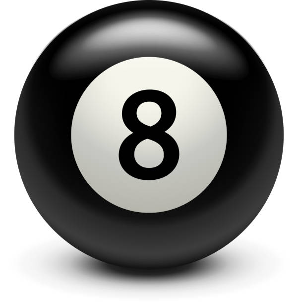

# TITLE OF PROJECT

BILLY-BALL
SAMA HOJABRI

[View this project online](https://consumedlocusts.github.io/cart253/topics/billy-ball)

## Description

> _billy-ball_ is a portrait of an 8ball named "billy", draw using text "erasure". It is less a portrait, rather a subconscious desire to learn a mastery level of the game pool ('8 ball').

> Using the mouse, simply hover over the text rapidly to reveal a greyscaled drawing of the imported image of billy. If the mouse is pressed, a "transparent" red circle appears directed by the cursor. Using this feature and billy's appearance, locate the best point to hit him, call your shot...coming soon...

## Screenshot(s)

> 

## Attribution

References

> - This project uses [p5.js](https://p5js.org).
> - The 8ball is a free istock i found on google.
> - reference youtube: https://www.youtube.com/watch?v=55iwMYv8tGI, https://www.youtube.com/watch?v=4IyeLc6J1Uo
> - reference codes: https://editor.p5js.org/codingtrain/sketches/ytK7J7d5j, https://editor.p5js.org/codingtrain/sketches/LNBpdYQHP

## License

N/A
