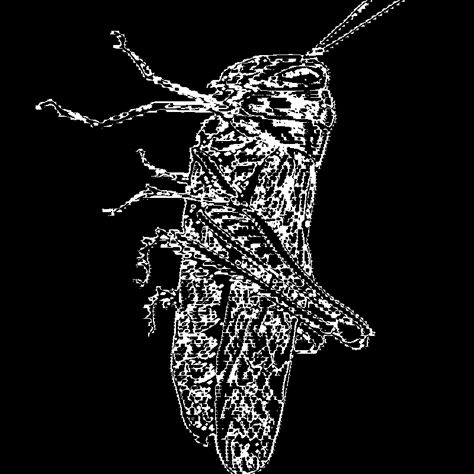

# Locust.host

Sama Hojabri

[View this project online](https://consumedlocusts.github.io/cart253/topics/locust.host/)

## Description

- Story based, using original video, audio, noise effect visuals, and text-based expressions with simple interactive aspects. It follows the biblical tellings of the locusts spawn and reign, it is fairly loosely based on the actual story as I am neither specifically religious or familiar with the bible, yet I am using direct quotes for each opening scene for dramatic effect.

- Three scenes/video/audio/visuals separated from one another but relate as they are in the same universe. All commands to progress within each menu option (scene change, progress to next scene) within the modes are executed by keypress, to return to the main menu, mousepress the final scene (when one cannot keypress anymore to see, text displayed ordering to do so).

- Menu option has the three games/”variations”: wormwood, signs of the swarm, the end times. When the user hover over the texts, before clicking to initiate the scene/game, a subtext/caption under the title texts appears. Wormwood; “Shaft of the Abyss”, devastation. Signs of the Swarm; “Destroyer”, destruction. The end times; “God’s hate”, desolation.

- The MAIN MENU is an ascii style image of a locust, user is encouraged to fill in/draw it, just an extra interactive feature.
- The purpose of this project was for me to learn math, vectors, and classes using tutorials and source codes.

## Screenshot(s)

> 

## Attribution

> - This project uses [p5.js](https://p5js.org).

> titles, names, text:
>
> - wormwood:
> - title: this mode is named after "Wormwood", the described "fallen star" in Revelation 8:10-11.
> - signs of the swarm:
> - title: this mode is directly named after "Signs of the Swarm", an American deathcore band from Pittsburgh, Pennsylvania.
> - the end times:
> - title: original, but subtitle is named after the hardcore band "Gods Hate".
>   audio & video:
>
> - The song appearing in "signs of the swarm" is written, played and edited by me using a music box melody creator to write/edit custom music box melodies https://musicboxmaniacs.com. It was then further edited using a MIDI keyboard and garageband.
> - the video appearing during the first state of "wormwood" was created from scratch using TouchDesigner.

> source codes and tutorials:
>
> - FFT & sound visuals tutorial:
> - https://www.youtube.com/watch?v=8O5aCwdopLo > https://editor.p5js.org/pattvira/sketches/KB9supaPG

> "Openprocessing" inspirations, tutorials & sourced codes.

> - https://openprocessing.org/sketch/1462839
> - https://openprocessing.org/sketch/2705181
> - https://openprocessing.org/sketch/2729961
> - https://openprocessing.org/sketch/1050677
> - https://openprocessing.org/sketch/2308471
> - https://openprocessing.org/sketch/2791327
> - https://openprocessing.org/sketch/2615328
> - x
> - https://openprocessing.org/sketch/1776463/#page-8

## License

N/A
